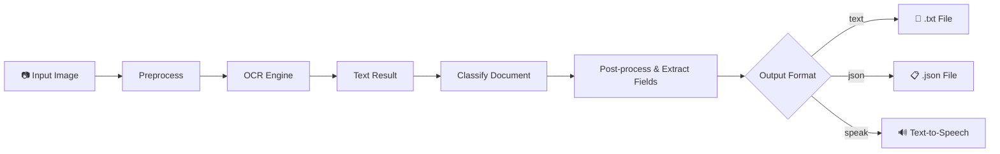
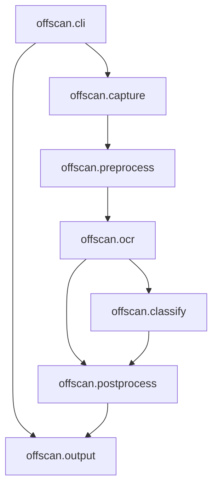
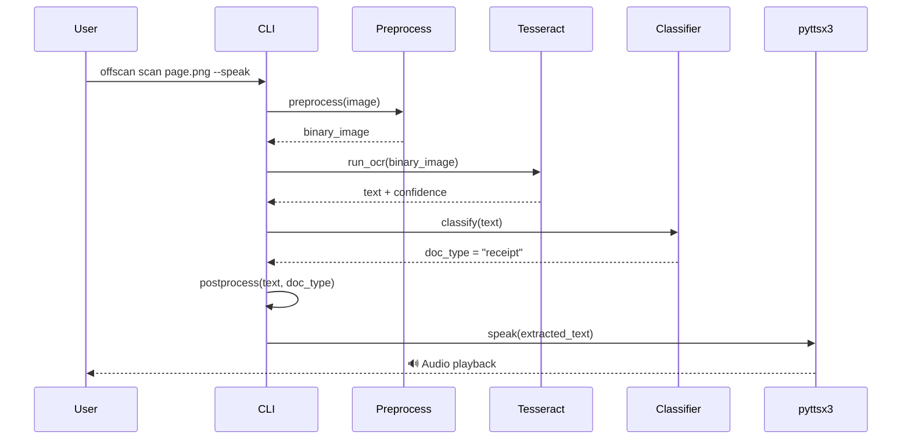
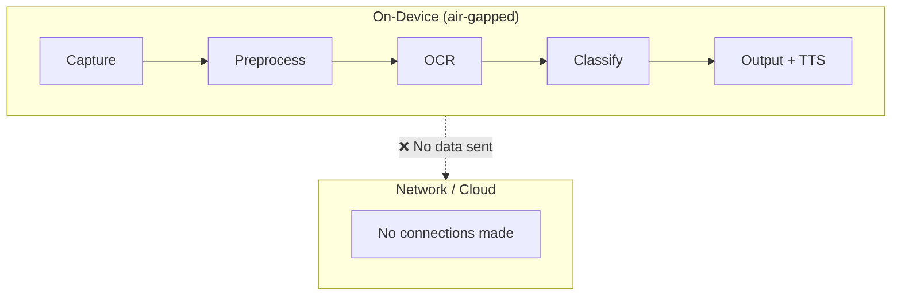

# OffScan — Architecture

> Full pipeline architecture for the offline document scanning, OCR, and
> text-to-speech system.

## Overview

OffScan is a **fully offline** pipeline that takes a photographed document,
corrects perspective and lighting, runs OCR with Tesseract, optionally
classifies document type with an ONNX model, and reads the result aloud via
pyttsx3 — all without a single network request.

```
┌─────────────────────────────────────────────────────────────┐
│                        OffScan Pipeline                      │
│                                                             │
│  ┌──────────┐   ┌─────────────┐   ┌──────────┐   ┌────────┐ │
│  │  Capture  │──▶│ Preprocess  │──▶│   OCR    │──▶│ Class. │ │
│  │ (OpenCV)  │   │  (OpenCV)   │   │(Tesseract)│  │ (ONNX) │ │
│  └──────────┘   └─────────────┘   └──────────┘   └────┬───┘ │
│                                                       │     │
│  ┌──────────┐   ┌─────────────┐                       ▼     │
│  │  Output   │◀──│  Text Post  │◀──  ┌──────────────────────┐│
│  │ (file/TTS)│   │  -process   │     │  scikit-learn features││
│  └──────────┘   └─────────────┘     └──────────────────────┘│
└─────────────────────────────────────────────────────────────┘
```

## Pipeline Stages

### 1. Capture / Input (`offscan.capture`)

- Accepts an image file path (PNG, JPEG, TIFF) or a directory for batch mode.
- Uses OpenCV `imread` to load the image into a NumPy array.
- Supports both photographic captures (perspective-distorted) and flat scans.

### 2. Preprocessing (`offscan.preprocess`)

This is the most computationally intensive stage. Steps:

| Step | Technique | Library |
|------|-----------|--------|
| Grayscale conversion | `cv2.cvtColor` | OpenCV |
| Noise reduction | Bilateral filter | OpenCV |
| Binarization | Adaptive thresholding (Gaussian) | OpenCV |
| Deskewing | Hough-line + min-area rectangle | OpenCV |
| Perspective correction | Four-point transform | OpenCV |
| Border / margin removal | Contour crop | OpenCV |

All operations are **deterministic** — given the same input, the output is
always identical. No ML inference or random seeds are used here.

### 3. OCR (`offscan.ocr`)

- Engine: **Tesseract OCR** via `pytesseract`.
- Language packs are bundled in the Docker image and installed system-wide.
- Single-page mode returns a structured `OcrResult` with text, confidence
  scores, and bounding boxes.
- Multi-page / batch mode iterates over a directory.

```python
from offscan.ocr import run_ocr

result = run_ocr("preprocessed_image.png", lang="eng")
print(result.text)          # recognized text
print(result.confidence)     # mean confidence 0.0–1.0
```

### 4. Document Classification (`offscan.classify`)

- Runtime: **ONNX Runtime** (`onnxruntime`) for the neural classifier.
- Feature extraction: **scikit-learn** TF-IDF vectorizer (fitted offline,
  shipped as a `.pkl` artifact).
- Classes: receipt, invoice, form, letter, ID document, handwritten note,
  other.
- The ONNX model is loaded once at startup and reused across all pages.

### 5. Text Post-processing (`offscan.postprocess`)

- Regex-based field extraction (dates, amounts, phone numbers, emails).
- Spell-check against a bundled dictionary (optional).
- Whitespace and line-break normalization.
- Structured output as JSON or plain text.

### 6. Output (`offscan.output`)

- **Text:** Write `.txt` or `.json` to disk.
- **Audio:** `pyttsx3` reads the text aloud using the system's local
  speech engine (espeak-ng on Linux, AVSpeechSynthesizer on macOS, SAPI on
  Windows).
- **Interactive:** `rich` console output for CLI usage.

## Mermaid Diagrams

### High-Level Data Flow



### Module Dependency Graph



### Runtime Sequence (Single Page)



### Offline Boundary



## Data Flow Summary

| Stage | Input | Output | Library |
|-------|-------|--------|--------|
| Capture | File path | `np.ndarray` (BGR) | OpenCV |
| Preprocess | `np.ndarray` | Binary `np.ndarray` | OpenCV |
| OCR | Binary image | `OcrResult(text, conf, boxes)` | Tesseract / pytesseract |
| Classify | Text | `ClassificationResult(label, score)` | ONNX Runtime + scikit-learn |
| Post-process | Text + label | Structured fields (JSON) | stdlib regex + scikit-learn |
| Output | Structured result | File + audio | stdlib + pyttsx3 |

## Configuration

OffScan reads configuration from (in order of priority):

1. CLI flags (`--lang`, `--dpi`, `--speak`, `--output-format`)
2. Environment variables (`OFFSCAN_LANG`, `OFFSCAN_DPI`)
3. `.offscan.toml` in the project root
4. Built-in defaults

No configuration value triggers a network call.

## Performance Characteristics

| Metric | Typical (A4 page, 300 DPI) |
|--------|--------------------------|
| Preprocessing | 200–500 ms |
| OCR | 300–800 ms |
| Classification | 20–50 ms |
| TTS (per page) | 1–3 s |
| Total per page | ~1.5–4.5 s |

Benchmarks run on Intel i5-1240P, 16 GB RAM, Python 3.11. All times are
single-threaded CPU-only.

## Extension Points

- **New OCR engine:** Implement `OcrEngine` protocol, register via entry points.
- **New classifier:** Export an ONNX model, place in `models/`, update config.
- **New output format:** Implement `OutputWriter` protocol.
- **New language pack:** Install Tesseract language data; pass `--lang`.

All extensions remain offline — no plugin may make network requests.
